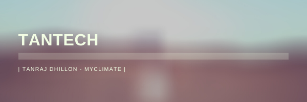
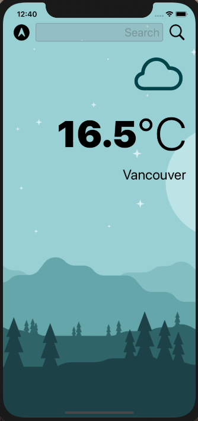
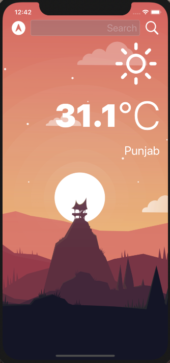

# MyClimate

## About The Application

MyClimate is a super simple weather app that is compatible with dark mode! It uses the OpenWeatherMap API and supports getting the weather from your current GPS location. If you're like me and don't need all the extra clutter aside from the current weather outside, MyClimate is for you.

## Screenshots

### Light Mode:

### Dark Mode:

## What I learned

* How to create a dark-mode enabled app.
* How to use vector images as image assets.
* Learned about the delegate patters.
* Advanced Swift protocols and extensions.
* Advanced Swift closures and completion handlers.
* Learn to use URLSession to network and make HTTP requests.
* Parse JSON with the native Encodable and Decodable protocols.
* Learn to use Core Location to get the current location from the phone GPS.

